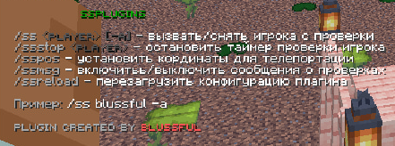

# Документация по плагину

<p align="center">
    
</p>


<p align="center">
    
</p>

## Описание

Плагин позволяет вызывать игроков на проверку, устанавливать точки телепортации для проверки и управлять сообщениями, связанными с процессом проверки. Также поддерживает остановку таймера проверки, перезагрузку конфигурации и автоматические действия при таймауте или выходе игрока.

## Требования

- Сервер Minecraft версий 1.16.5–1.20.1 с поддержкой плагинов (например, Spigot, Paper).
- Java 8 или выше.

---

## Установка

1. Скачайте последнюю версию плагина из раздела [Releases](https://github.com/BlussFul/ssplugin/releases).
2. Поместите файл ssplugin.jar в папку plugins вашего сервера Minecraft.
3. Перезапустите сервер для активации плагина.

---

## Команды

### ```/ss <player> [-a]```

Вызывает указанного игрока на проверку или снимает проверку.

- Параметр <player> — имя игрока для вызова или снятия проверки.
- Опция -a — при вызове с этой опцией проверяемый телепортируется в заранее установленную точку.

Пример использования:
/ss Blussful
/ss Blussful -a

---

### ```/ssstop <player>```

Останавливает таймер проверки указанного игрока.

Пример использования:
/ssstop Blussful

---

### ```/ssmsg```

Включает или отключает получение сообщений от игроков, находящихся на проверке, для операторов.

Пример использования:
/ssmsg

---

### ```/sspos```

Устанавливает точку телепортации для проверки. Игроки, вызванные с опцией -a команды /ss, будут телепортированы в эту точку.

Пример использования:
/sspos

---

### ```/ssreload```

Перезагружает конфигурацию плагина без перезапуска сервера.

Пример использования:
/ssreload

---

## Разрешения

Все разрешения начинаются с префикса bl. или ssplugin. и используются для управления доступом к функциям плагина.

| Разрешение          | Описание                                            | Значение по умолчанию |
|---------------------|-----------------------------------------------------|-----------------------|
| bl.ss               | Разрешение вызывать проверку игроков                | op                    |
| bl.ssstop           | Разрешение использовать команду /ssstop             | op                    |
| bl.ssmsg            | Разрешение включать/выключать получение сообщений   | op                    |
| ssplugin.setpos     | Разрешение устанавливать позицию проверки           | op                    |
| bl.ssreload         | Разрешение перезагружать конфигурацию плагина       | op                    |
| bl.ss.bypass        | Разрешает/запрещает вызывать игрока на проверку     | op                    |

---

## Конфигурационный файл

Файл конфигурации (config.yml) позволяет настраивать сообщения, длительность проверки, координаты точки телепортации, платформу под игроком и действия при таймауте или выходе игрока.

Пример конфигурации:

```
# Разрешённые команды, которые можно использовать во время проверки
command:
  - /msg

# Сообщения, отображаемые во время проверки
messages:
  title_main: '&cВЫ НА ПРОВЕРКЕ' # Основной заголовок
  title_sub: '&eБудьте терпеливы и внимательны' # Подзаголовок
  toggle_on_checker: '&aВы поставили %target% на проверку' # Сообщение проверяющему при начале проверки
  toggle_on_target: '&cВы поставлены на проверку игроком %checker%' # Сообщение проверяемому при начале проверки
  toggle_off_checker: '&aВы сняли проверку с %target%' # Сообщение проверяющему при снятии проверки
  toggle_off_target: '&aПроверка с вас снята игроком %checker%' # Сообщение проверяемому при снятии проверки
  no_permission: '&cУ вас нет прав для использования этой команды' # Сообщение при отсутствии прав
  player_not_found: '&cИгрок не найден' # Сообщение при отсутствии игрока

# Длительность проверки в секундах
check_duration_seconds: 180

# Тип блока для платформы под игроком во время проверки
platform_block: STONE

# Включить или отключить установку платформы под игроком
platform_enabled: true

# Координаты для телепортации проверяемого (если используется -a)
checkLocation:
  world: world
  x: -22.640432104331424
  y: 31.0
  z: 155.42215866032697
  yaw: -303.65344
  pitch: 13.640387

# Действия при таймауте проверки и при выходе игрока во время проверки
actions:
  on_timeout: "/ban %user% 30d игнор проверки"
  on_quit: "/ban %user% 30d лив с проверки"

- platform_enabled — включает или отключает установку платформы под игроком во время проверки.
- actions.on_timeout — команда, выполняемая при истечении времени проверки (например, бан).
- actions.on_quit — команда, выполняемая при выходе игрока во время проверки.
```
---

## Авторы

- BlussFul — разработчик плагина,
- Kironoshi — автор документации.